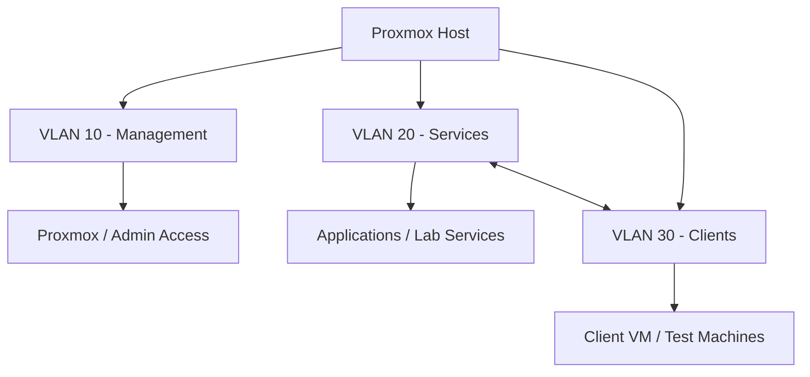
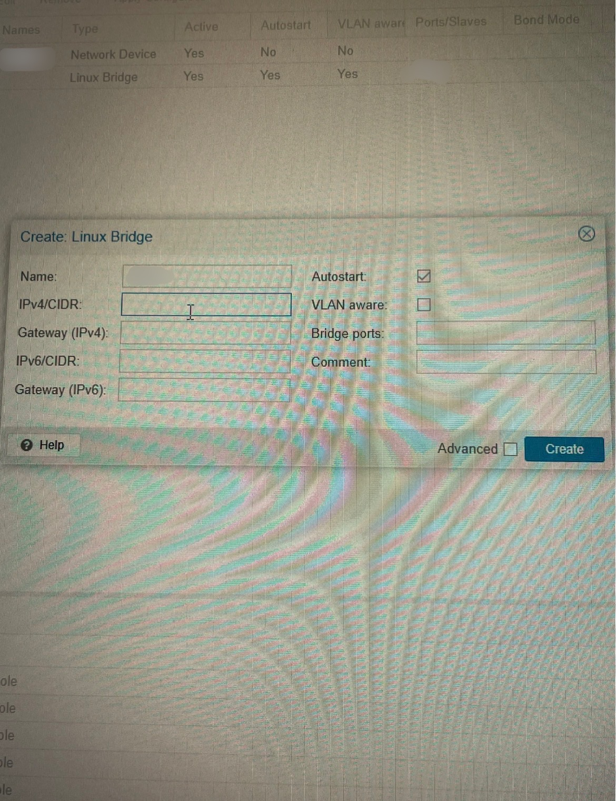

# Blue-Team-Home-Lab

## Overview 
This project documents the design and implementation of a virtualized home lab on Proxmox VE. The environment focuses on network segmentation using VLANs, virtual machine deployment, and controlled communication between isolated network segments. The lab is designed to simulate real-world infrastructure used in cybersecurity and IT environments, serving as a foundation for security tools such as SIEM, vulnerability scanning, and identity management systems.

## Skills Demonstrated
- Proxmox virtualization (KVM)
- VLAN configuration & network segmentation
- Linux networking & interface configuration
- Inter-VLAN communication & routing concepts
- Infrastructure design & troubleshooting
- System validation & connectivity testing

## Lab Environment
- Hypervisor: Proxmox VE
- Virtualization: KVM virtual machines
- Networking: VLAN-aware Linux Bridge
- Guest OS: Ubuntu/Debian-based systems

## Architecture

## Validation & Implementation

### Network Design (Initial Plan)

### Proxmox VLAN Configuration

### Firewall Rules (pfSense)

### Connectivity & Routing Validation

These screenshots demonstrate the progression from initial design to implementation, configuration, and validation of the segmented network environment.

## Firewall Policy Summary

| Source VLAN | Destination | Allowed | Purpose |
|------------|------------|--------|--------|
| Clients | Services | Yes | Access applications |
| Clients | Management | No | Protect admin access |
| Management | All | Yes | Administrative control |

### Firewall Behavior Insight

A key troubleshooting moment occurred when ICMP (ping) failed while HTTPS (443) access to the pfSense WebGUI succeeded.

This demonstrated that the issue was not network connectivity, but firewall policy enforcement. The firewall was correctly allowing HTTPS traffic while blocking ICMP, highlighting the importance of protocol-specific validation during troubleshooting.

## Validation & Testing

The following validations were performed to ensure proper network segmentation and functionality:

- Verified inter-VLAN communication between Services and Clients
- Confirmed Management VLAN isolation from client traffic
- Validated DHCP assignments per VLAN
- Tested firewall rules enforcing least-privilege access
- Confirmed access to required services

Screenshots included demonstrate:
- Proxmox VLAN configuration
- pfSense interface assignments
- Firewall rule implementation
- Successful client connectivity

## Build Progress

- ✅ Proxmox installation and base configuration  
- ✅ VLAN segmentation and network design  
- ✅ pfSense firewall deployment and rule configuration  
- 🔄 SIEM integration (Wazuh) – in progress  
- ⏳ Log analysis and monitoring  
- ⏳ IDS/IPS deployment 

## Future Expansion

This lab will continue evolving into a full blue-team environment:

- Wazuh SIEM deployment and alerting
- Centralized log aggregation and analysis
- IDS/IPS implementation and tuning
- Threat detection and incident response workflows
- Expanded VLAN segmentation and access controls

## Key Takeaways

This project demonstrates the ability to design, build, and troubleshoot a segmented virtual network environment using enterprise-relevant tools and concepts.

Key outcomes:
- Built a VLAN-segmented network from scratch
- Implemented firewall-based access control using pfSense
- Troubleshot real-world networking issues across multiple layers
- Established a scalable foundation for security monitoring and detection labs

The most valuable learning came from diagnosing and resolving misconfigurations, reinforcing a structured and methodical troubleshooting approach.