# Blue-Team-Home-Lab

Enterprise-style cybersecurity home lab built using **Proxmox VE**, **pfSense**, **Windows Server 2022**, **Active Directory**, **Wazuh SIEM**, **Windows 11**, and **Linux** to simulate a segmented small-business environment.

The goal of this project is to demonstrate enterprise infrastructure deployment, virtualization, Windows domain administration, network segmentation, centralized security monitoring, endpoint security, Group Policy administration, and blue-team operations.

---

# Table of Contents

- Overview
- Skills Demonstrated
- Current Lab Environment
- Architecture
- Project Timeline
- Completed Features
- Implementation Journey
    - Phase 1 – Network Planning
    - Phase 2 – Proxmox VE Deployment
    - Phase 3 – pfSense Firewall & Network Segmentation
    - Phase 4 – Wazuh SIEM Deployment
    - Phase 5 – Windows Server 2022 Deployment
    - Phase 6 – Active Directory Domain Services
    - Phase 7 – Windows 11 Enterprise Client
    - Phase 8 – Group Policy & Security Auditing
    - Phase 9 – Wazuh Windows 11 Endpoint Integration
    - Phase 10 – Sysmon Endpoint Telemetry
    - Phase 11 – Splunk Enterprise Detection & Alerting
- Firewall Policy Summary
- Troubleshooting & Validation Highlights
- Future Expansion
- Key Takeaways

---

# Overview

This project demonstrates the design, deployment, administration, and security monitoring of an enterprise-style cybersecurity lab using virtualization and modern infrastructure technologies.

The environment currently includes:

- Proxmox VE virtualization
- pfSense firewall
- VLAN segmentation
- Windows Server 2022
- Active Directory Domain Services
- Active Directory-integrated DNS
- Windows 11 domain workstation
- Organizational Units
- Active Directory users and security groups
- Group Policy
- Windows Defender Firewall management
- Advanced Windows security auditing
- Wazuh SIEM
- Sysmon endpoint telemetry
- Splunk Enterprise
- Windows Security log forwarding
- SPL-based detection engineering
- Scheduled security alerting
- Email alert notifications
- Linux administration
- Windows and Linux endpoint monitoring
- Enterprise network architecture

---

# Skills Demonstrated

### Virtualization

- Proxmox VE
- Virtual Machine Deployment
- VirtIO Drivers
- QEMU Guest Agent
- Snapshot Management
- Virtual Network Configuration

### Networking

- pfSense Firewall
- VLAN Configuration
- IEEE 802.1Q VLAN Tagging
- Inter-VLAN Routing
- Static IP Configuration
- DHCP
- Network Segmentation
- DNS Configuration
- Network Troubleshooting
- Firewall Rule Administration

### Windows Administration

- Windows Server 2022
- Windows 11 Pro
- Active Directory Domain Services
- Domain Controller Deployment
- DNS Server
- Domain Join Administration
- Organizational Units
- Active Directory Users
- Security Groups
- Group Policy Objects
- Windows Security Event Logs

### Linux Administration

- Ubuntu Server
- Linux Mint
- SSH
- Package Management
- Linux Networking
- Service Management

### Security

- Wazuh SIEM
- Endpoint Monitoring
- Windows Agent Deployment
- Linux Agent Deployment
- Sysmon Deployment
- Sysmon Configuration
- Endpoint Telemetry Collection
- Windows Defender Firewall
- Group Policy Security Baselines
- Advanced Audit Policy
- Authentication Event Monitoring
- Windows Event ID Analysis
- Firewall Rule Creation
- Security Validation and Troubleshooting
- Splunk Enterprise
- Splunk Universal Forwarder
- Windows Security Log Ingestion
- SPL Query Development
- Detection Engineering
- Scheduled Alert Configuration
- Security Event Correlation
- Email Alert Integration

---

# Current Lab Environment

## Infrastructure

- Proxmox VE Hypervisor
- pfSense Community Edition
- Netgear Managed Switch
- VLAN-aware Linux Bridge (`vmbr1`)

## Network Segmentation

| VLAN | Purpose | Network | Gateway |
|---|---|---|---|
| VLAN 99 | Management | `192.168.99.0/24` | `192.168.99.1` |
| VLAN 10 | Clients | `192.168.10.0/24` | `192.168.10.1` |
| VLAN 20 | Servers | `192.168.20.0/24` | `192.168.20.1` |

## Management

### Linux Mint Management Workstation

- Hostname: `linuxmint-mgmt01`
- IP Address: `192.168.99.100`
- VLAN: 99
- QEMU Guest Agent
- Wazuh Agent
- Firefox Management Station
- SSH Administration

## Security

### Wazuh Manager

- Hostname: `wazuh-mgr-01`
- IP Address: `192.168.20.10`
- VLAN: 20
- Wazuh Manager
- Wazuh Dashboard
- Wazuh Indexer
- Endpoint Monitoring

### Splunk Enterprise

- Hostname: `SPLUNK01`
- VLAN: 20
- Splunk Enterprise
- Windows Security Log Ingestion
- Splunk Universal Forwarder Receiver
- SPL Detection Queries
- Scheduled Alerting
- Email Alert Notifications

## Windows Server

### DC01

- Operating System: Windows Server 2022
- Hostname: `DC01`
- IP Address: `192.168.20.20`
- VLAN: 20
- Active Directory Domain Services
- DNS Server
- Domain Controller
- Domain: `homelab.local`
- Wazuh Agent

## Windows Client

### WIN11-01

- Operating System: Windows 11 Pro
- Hostname: `WIN11-01`
- VLAN: 10
- Client Address: `192.168.10.101` during validation
- Gateway: `192.168.10.1`
- DNS Server: `192.168.20.20`
- Domain: `homelab.local`
- Workstations OU
- Workstation Security Baseline GPO
- Wazuh Agent
- Sysmon
- Modular Sysmon Configuration
- Sysmon Operational Event Collection
- Splunk Universal Forwarder
- Windows Application, Security, and System log forwarding

---

# Architecture

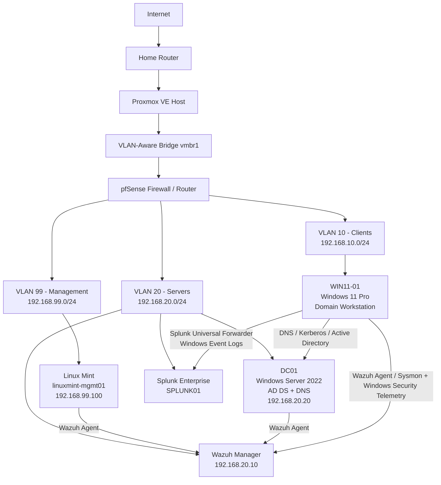
```mermaid
graph TD

    INTERNET[Internet]
    ROUTER[Home Router]
    PVE[Proxmox VE Host]
    BRIDGE[VLAN-Aware Bridge vmbr1]
    PF[pfSense Firewall / Router]

    INTERNET --> ROUTER
    ROUTER --> PVE
    PVE --> BRIDGE
    BRIDGE --> PF

    PF --> MGMT[VLAN 99 - Management<br/>192.168.99.0/24]
    PF --> CLIENT[VLAN 10 - Clients<br/>192.168.10.0/24]
    PF --> SERVER[VLAN 20 - Servers<br/>192.168.20.0/24]

    MGMT --> MINT[Linux Mint<br/>linuxmint-mgmt01<br/>192.168.99.100]

    CLIENT --> WIN11[WIN11-01<br/>Windows 11 Pro<br/>Domain Workstation]

    SERVER --> DC01[DC01<br/>Windows Server 2022<br/>AD DS + DNS<br/>192.168.20.20]
    SERVER --> WAZUH[Wazuh Manager<br/>192.168.20.10]
    SERVER --> SPLUNK[Splunk Enterprise<br/>SPLUNK01]

    WIN11 -->|DNS / Kerberos / Active Directory| DC01
    MINT -->|Wazuh Agent| WAZUH
    DC01 -->|Wazuh Agent| WAZUH
    WIN11 -->|Wazuh Agent / Sysmon + Windows Security Telemetry| WAZUH
    WIN11 -->|Splunk Universal Forwarder<br/>Windows Event Logs| SPLUNK
```

The environment separates administrative systems, client endpoints, and server infrastructure while allowing required communication through pfSense firewall policies.

WIN11-01 authenticates against DC01 across VLAN boundaries and uses the domain controller for Active Directory DNS. Windows Security and Sysmon telemetry from WIN11-01 are collected by Wazuh for centralized endpoint monitoring and detection. In parallel, Windows Application, Security, and System logs are forwarded from WIN11-01 to Splunk Enterprise, where SPL queries are used for detection engineering, scheduled alerting, and security event analysis.

---

# Project Timeline

✅ Phase 1 — Network Planning

✅ Phase 2 — Proxmox VE Deployment

✅ Phase 3 — pfSense Firewall & Network Segmentation

✅ Phase 4 — Wazuh SIEM Deployment

✅ Phase 5 — Windows Server 2022 Deployment

✅ Phase 6 — Active Directory Domain Services

✅ Phase 7 — Windows 11 Enterprise Client

✅ Phase 8 — Group Policy & Windows Security Auditing

✅ Phase 9 — Wazuh Windows 11 Endpoint Integration

✅ Phase 10 — Sysmon

✅ Phase 11 — Splunk Enterprise Detection & Alerting

🔄 Phase 12 — Attack Simulation & Detection

---

# Completed Features

- Proxmox VE deployment
- Virtual machine provisioning
- VLAN-aware networking
- pfSense firewall deployment
- Inter-VLAN routing
- VLAN 99 Management network
- VLAN 10 Client network
- VLAN 20 Server network
- Linux Mint management workstation
- Ubuntu Server deployment
- Wazuh SIEM deployment
- Windows Server 2022 deployment
- Active Directory Domain Services
- Active Directory-integrated DNS
- Static IP addressing
- DHCP configuration
- VirtIO driver installation
- QEMU Guest Agent deployment
- Wazuh Windows Server Agent deployment
- Wazuh Linux Agent deployment
- Windows 11 Pro deployment
- Active Directory domain join
- Organizational Unit creation
- Active Directory user administration
- Active Directory security groups
- Group Policy deployment
- Windows Defender Firewall policy
- Advanced Windows auditing
- Windows authentication event validation
- Wazuh Windows 11 Agent deployment
- Windows Security Event ingestion
- Failed authentication detection
- Windows Event ID 4625 analysis
- Sysmon deployment
- Modular Sysmon configuration
- Sysmon Operational event collection
- Wazuh Sysmon integration
- Sysmon detection rule validation
- Centralized Sysmon telemetry analysis
- Splunk Enterprise deployment
- Splunk Universal Forwarder deployment
- Windows Application, Security, and System log ingestion
- Centralized Splunk event analysis
- SPL detection query development
- Windows Event ID 4625 detection
- Repeated failed-login detection
- Scheduled Splunk alert configuration
- Triggered alert validation
- Email security alert notification
- Proxmox storage expansion and LVM-Thin storage management

---

# Implementation Journey

## Phase 1 – Network Planning

### Objective

Design the initial enterprise network architecture before deployment.

### Figure 1 – Initial Network Planning

Initial whiteboard sketch created during the planning phase to design the enterprise network architecture. The diagram identifies the Proxmox virtualization host, pfSense firewall, Linux management workstation, VLAN segmentation strategy, and planned server infrastructure prior to implementation.

<p align="center">
  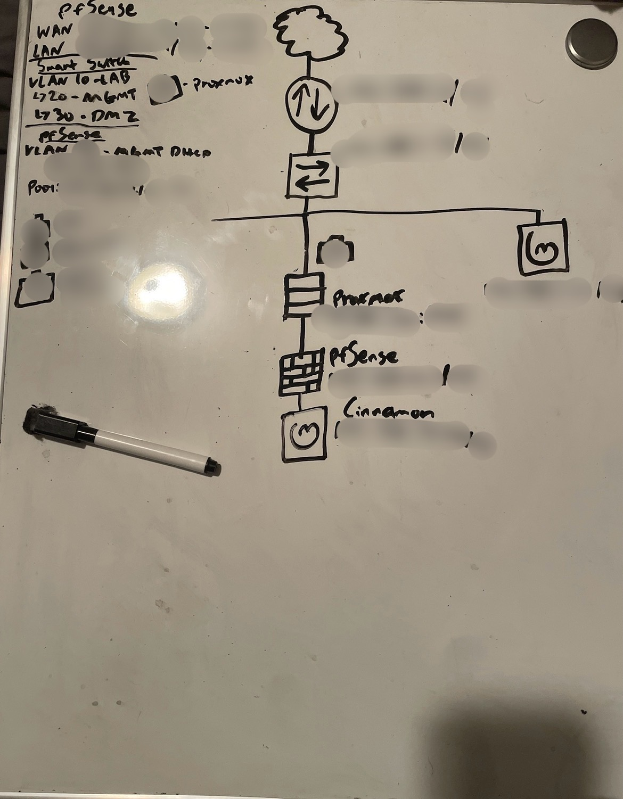
</p>

### Outcome

- Initial network topology established
- VLAN layout planned
- Firewall placement identified
- Management network designed

---

## Phase 2 – Proxmox VE Deployment

### Objective

Deploy Proxmox VE as the enterprise virtualization platform responsible for hosting and managing all virtual infrastructure within the homelab.

### Configuration

- Installed Proxmox VE
- Configured local and local-lvm storage
- Created VLAN-aware Linux Bridge (vmbr1)
- Enabled virtualization extensions
- Created virtual machines for:
  - pfSense
  - Linux Mint
  - Wazuh Manager
  - Windows Server 2022 (DC01)
  - Windows 11

### Validation

- Verified successful VM deployment
- Confirmed resource allocation
- Verified VM startup and shutdown
- Confirmed hypervisor stability

### Figure 2 – Proxmox Virtualization Platform

The Proxmox VE hypervisor serves as the foundation of the homelab, hosting all virtual machines while providing centralized management, storage, networking, and virtualization.

<p align="center">
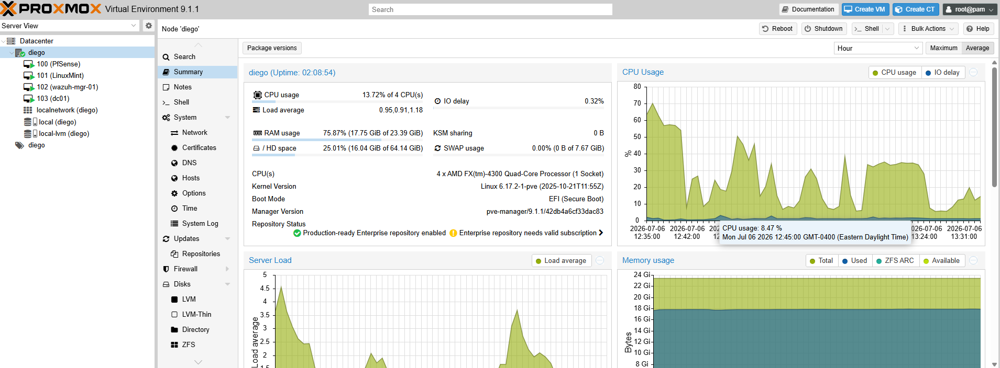
</p>

### Figure 3 – VLAN-Aware Linux Bridge Configuration

The Proxmox VLAN-aware Linux bridge (vmbr1) provides virtual switching for all guest machines while supporting IEEE 802.1Q VLAN tagging. This bridge enables pfSense to receive tagged traffic and route communication between management, client, and server networks.

<p align="center">

</p>

### Outcome

- Enterprise virtualization platform operational
- Multiple virtual machines deployed
- Centralized VM management established
- VLAN-aware virtual networking implemented
- Foundation prepared for network segmentation and security services

---

## Phase 3 – pfSense Firewall & Network Segmentation

### Objective

Deploy pfSense as the central firewall and router to provide network segmentation, inter-VLAN routing, and secure communication between management, client, and server networks.

### Configuration

- Installed pfSense Community Edition
- Configured WAN and LAN interfaces
- Created Management (VLAN 99)
- Created Client (VLAN 10)
- Created Server (VLAN 20)
- Configured VLAN interfaces
- Implemented inter-VLAN routing
- Created firewall rules for each VLAN
- Configured DHCP
- Configured static IP addressing
- Enabled HTTPS management
- Restricted management access
- Disabled unnecessary services

### Validation

- Verified VLAN communication
- Confirmed inter-VLAN routing
- Verified firewall rule enforcement
- Validated internet connectivity
- Confirmed management network isolation
- Tested communication between Linux Mint, Wazuh Manager, and Windows Server

### Figure 4 – pfSense Firewall Rules

The pfSense firewall was configured with VLAN-specific firewall policies to control communication between management, client, and server networks while maintaining secure administrative access.

<p align="center">
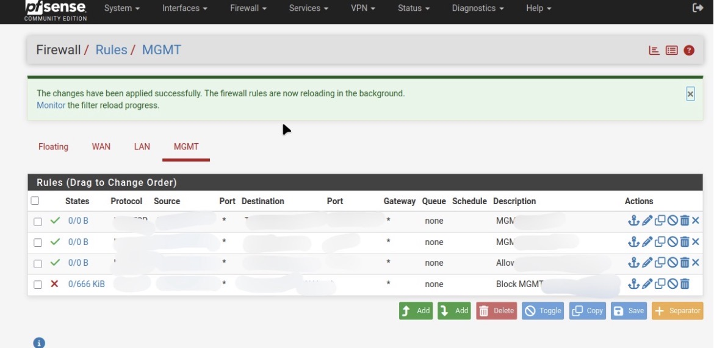
</p>

### Figure 5 – Network Connectivity Validation

Network connectivity was validated by testing communication between VLANs and verifying successful routing through the pfSense firewall.

<p align="center">
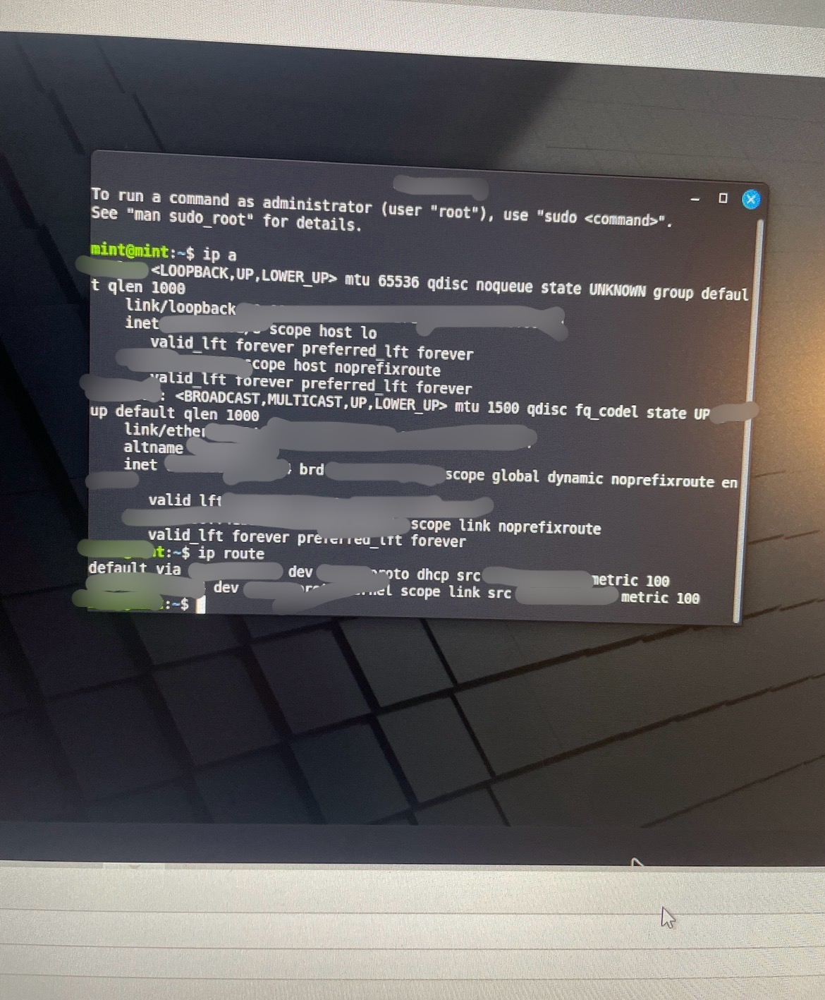
</p>

### Troubleshooting Insight

During testing, ICMP communication sometimes failed while HTTPS access to the pfSense WebGUI remained functional.

This demonstrated that the issue was caused by protocol-specific firewall policy rather than general network connectivity. 

The behavior reinforced the importance of validating individual protocols and ports rather than relying exclusively on ICMP when troubleshooting networks.

### Outcome

- Successfully deployed pfSense as the core firewall and router
- Implemented secure VLAN segmentation
- Established controlled inter-VLAN routing
- Verified firewall policy enforcement
- Created a secure network foundation for Active Directory and Wazuh SIEM

---

## Phase 4 – Wazuh SIEM Deployment

### Objective

Deploy Wazuh as the centralized Security Information and Event Management (SIEM) platform to collect, analyze, and monitor security events from Windows and Linux endpoints through a unified management interface.

### Configuration

- Deployed Ubuntu Server 24.04 LTS
- Installed Wazuh Manager
- Installed and configured Wazuh Dashboard
- Installed Wazuh Indexer
- Configured HTTPS dashboard access
- Installed Linux Mint endpoint agent
- Installed Windows Server endpoint agent
- Registered Windows and Linux endpoints with the Wazuh Manager

### Validation

- Verified Wazuh Manager services
- Confirmed Dashboard accessibility
- Verified Linux Mint agent registration
- Verified Windows Server agent registration
- Confirmed secure agent communication
- Validated centralized endpoint monitoring

### Figure 6 – Wazuh Dashboard

The Wazuh dashboard provides centralized visibility into monitored endpoints, security events, and system health.

<p align="center">
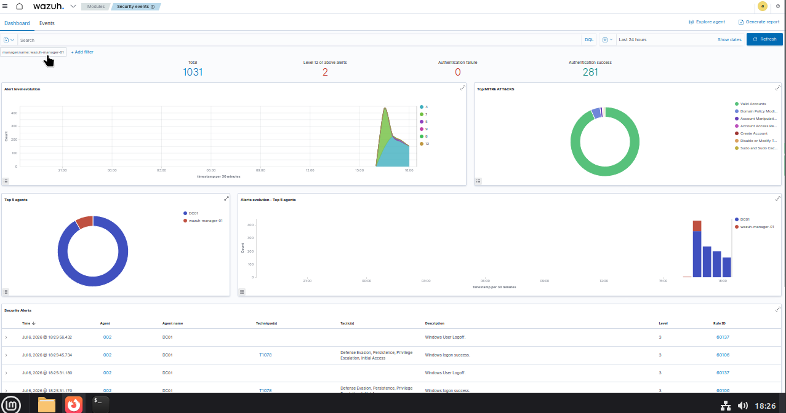
</p>

### Figure 7 – Registered Wazuh Agents

Both Windows Server and Linux Mint successfully enrolled with the Wazuh Manager, demonstrating centralized endpoint monitoring.

<p align="center">
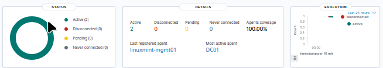
</p>

### Figure 8 – Windows Agent Deployment

The Windows Server Wazuh Agent service was verified to be installed and running.

<p align="center">
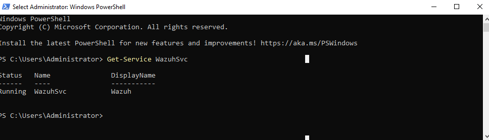
</p>

### Figure 9 – Linux Management Workstation Validation

The Linux Mint management workstation was validated with an active QEMU Guest Agent and Wazuh Agent.

<p align="center">
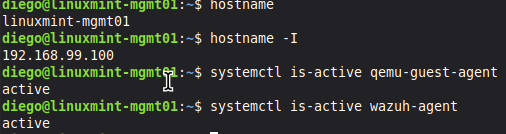
</p>

### Outcome

- Successfully deployed enterprise SIEM platform
- Centralized security monitoring established
- Windows and Linux endpoints enrolled
- Secure agent communication verified
- Foundation prepared for future threat detection and log analysis

---

## Phase 5 – Windows Server 2022 Deployment

### Objective

Deploy Windows Server 2022 as the enterprise server platform that will host Active Directory Domain Services and supporting infrastructure.

### Configuration


- Deployed Windows Server 2022 virtual machine in Proxmox VE
- Configured VirtIO networking
- Installed VirtIO drivers
- Installed QEMU Guest Agent
- Configured static IP addressing
- Renamed server to **DC01**
- Installed Windows updates
- Prepared server for Active Directory deployment
- Configured Server VLAN connectivity

### Validation

Verified server identity and configuration.

```text
hostname

DC01
```

```text
whoami

homelab\administrator
```

### Figure 10 – Server Manager

<p align="center">
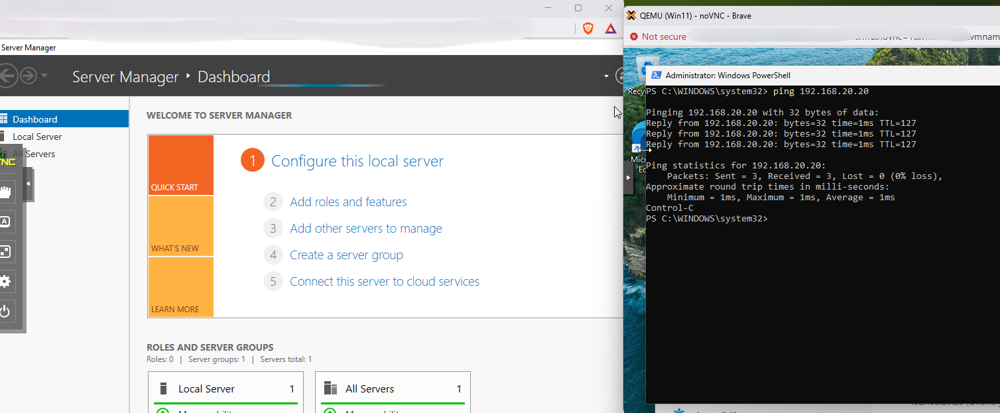
</p>

### Figure 11 – Static Network Configuration

<p align="center">
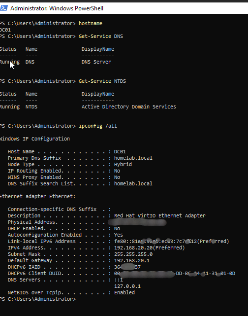
</p>

### Figure 12 – Server Validation

<p align="center">
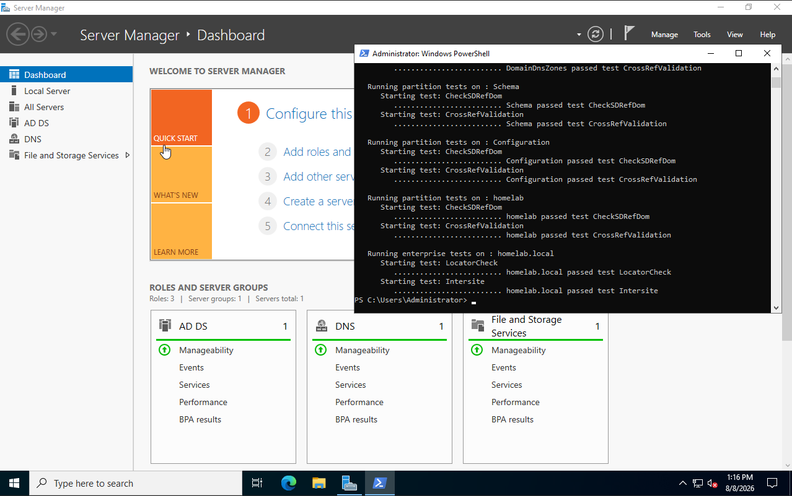
</p>

### Outcome

- Windows Server successfully deployed
- Enterprise server configuration completed
- Static network configuration verified
- Server prepared for Active Directory deployment

---

## Phase 6 – Active Directory Domain Services

### Objective

Deploy Active Directory Domain Services (AD DS) to provide centralized authentication, DNS, and identity management for the homelab.

### Configuration

- Installed Active Directory Domain Services
- Installed DNS Server
- Created new forest **homelab.local**
- Promoted DC01 to Domain Controller
- Configured Active Directory-integrated DNS
- Configured SYSVOL and NETLOGON
- Verified DNS service availability
- Configured DC01 with `192.168.20.20`

### Validation

- Verified Domain Controller promotion
- Confirmed Active Directory Users and Computers
- Verified DNS Manager functionality
- Verified `homelab.local` DNS zone
- Verified `dc01.homelab.local` resolution
- Confirmed domain services operational

### Figure 13 – Active Directory Users and Computers

<p align="center">
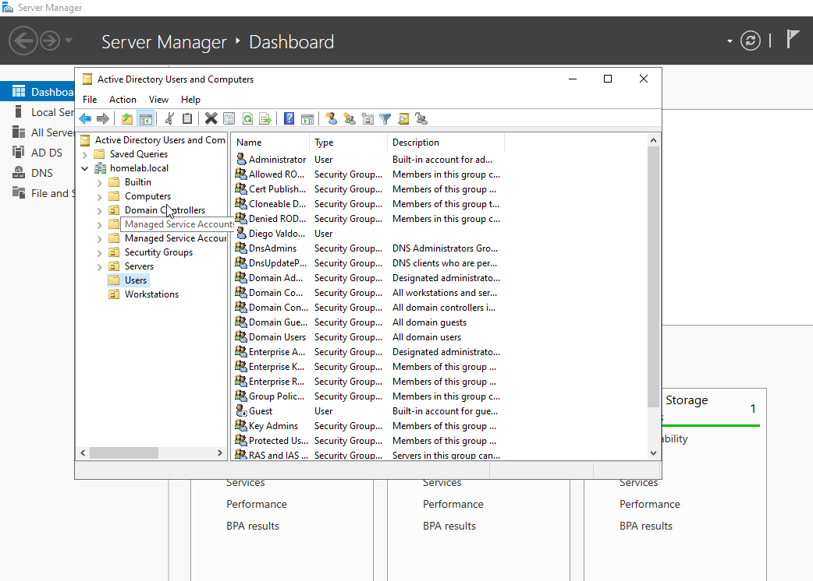
</p>

### Figure 14 – DNS Manager

<p align="center">
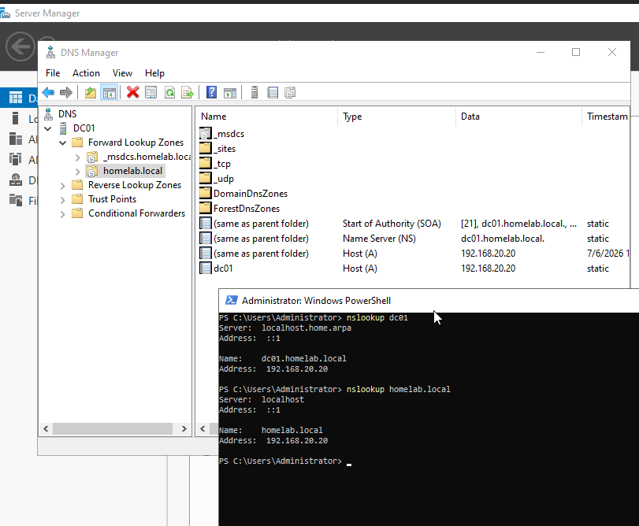
</p>

### Outcome

- Domain Controller successfully deployed
- Centralized authentication established
- Active Directory-integrated DNS operational
- Enterprise identity infrastructure established
- Infrastructure prepared for domain workstations

---

## Phase 7 – Windows 11 Enterprise Client

### Objective

Deploy a Windows 11 workstation on the Client network and integrate the endpoint with Active Directory to simulate a centrally managed enterprise workstation.

### Configuration

- Deployed Windows 11 Pro in Proxmox VE
- Installed VirtIO storage and network drivers
- Configured VirtIO network adapter
- Connected workstation to `vmbr1`
- Configured workstation for VLAN 10 Client network
- Verified DHCP communication
- Received client address `192.168.10.101`
- Configured gateway `192.168.10.1`
- Configured DNS server `192.168.20.20`
- Renamed workstation to **WIN11-01**
- Joined workstation to **homelab.local**
- Verified domain authentication

### Network Validation

WIN11-01 successfully received:

```text
IPv4 Address:     192.168.10.101
Subnet Mask:      255.255.255.0
Default Gateway:  192.168.10.1
DNS Server:       192.168.20.20
```

The client successfully reached both pfSense routing interfaces and DC01.

Active Directory DNS resolution was verified:

```text
nslookup dc01.homelab.local 192.168.20.20
```

Result:

```text
Name:    dc01.homelab.local
Address: 192.168.20.20
```

> Note: The addresses documented in this project are RFC1918 private lab addresses and are not publicly routable.

### Figure 15 – Windows 11 Domain Join

WIN11-01 successfully joined the `homelab.local` Active Directory domain.

<!-- SCREENSHOT PLACEHOLDER

Use the screenshot showing:

Welcome to the homelab.local domain.

Suggested filename:
images/windows11/domain-join.png
-->

<p align="center">
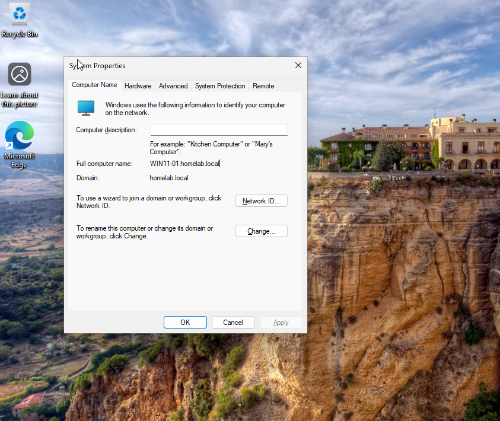
</p>

### Figure 16 – Domain Authentication Validation

Domain authentication was verified after rebooting WIN11-01.

Validation commands included:

```text
hostname
whoami
echo %USERDOMAIN%
echo %LOGONSERVER%
```

Expected results included:

```text
WIN11-01
homelab\administrator
HOMELAB
\\DC01
```

<!-- SCREENSHOT PLACEHOLDER

Use the screenshot showing:
hostname
whoami
USERDOMAIN
LOGONSERVER

Suggested filename:
images/windows11/domain-validation.png
-->

<p align="center">
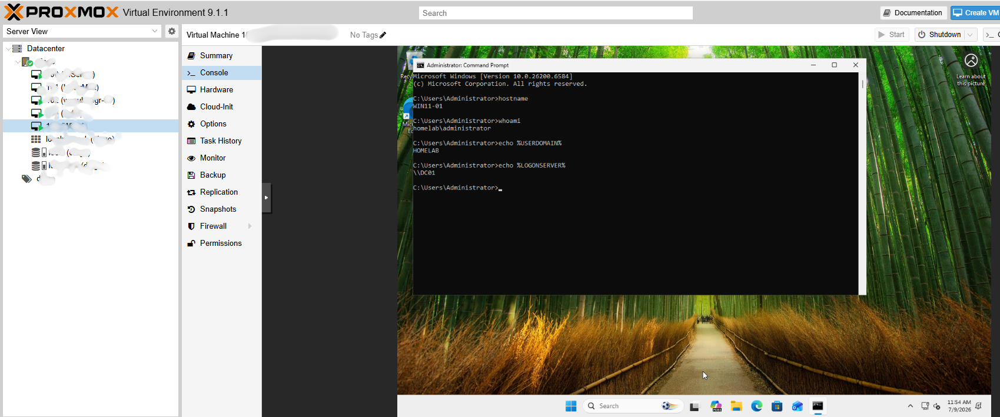
</p>

### Active Directory Organization

A dedicated Organizational Unit was created:

```text
Workstations
```

WIN11-01 was moved from the default Active Directory Computers container into the Workstations OU.

A standard domain user account was also created for workstation authentication.

An administrative security group was created:

```text
IT-Admins
```

### Figure 17 – Workstations Organizational Unit

WIN11-01 was organized into the Workstations OU to allow workstation-specific Group Policy management.

<!-- SCREENSHOT PLACEHOLDER

Use Active Directory Users and Computers showing:
Workstations
└── WIN11-01

Suggested filename:
images/active-directory/workstations-ou.png
-->

<p align="center">
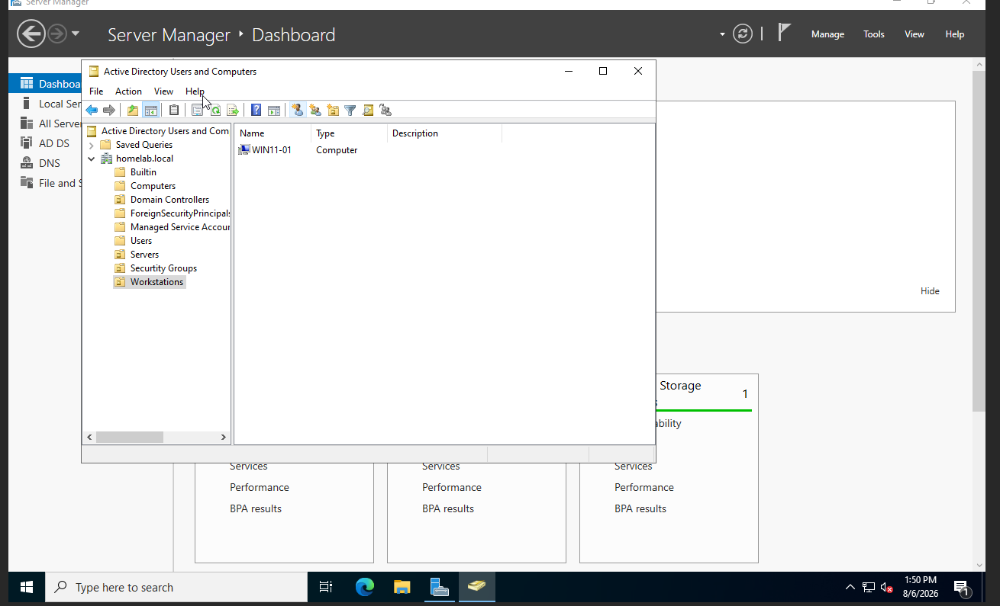
</p>

### Figure 18 – IT-Admins Security Group

The IT-Admins security group was created to support centralized administrative access management.

<!-- SCREENSHOT PLACEHOLDER

Use your screenshot showing:
IT-Admins Properties
Members
Domain user listed

Suggested filename:
images/active-directory/it-admins.png
-->

<p align="center">
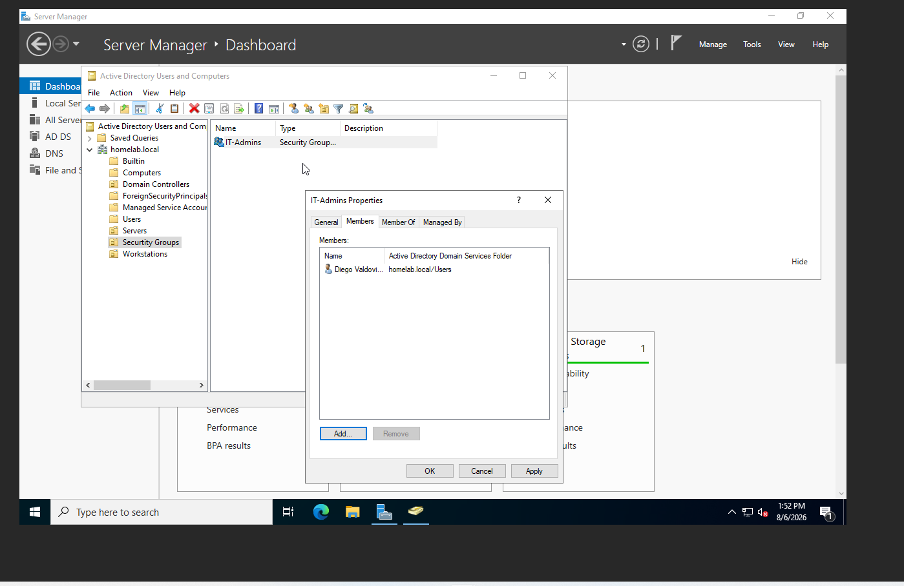
</p>

### Outcome

- Windows 11 enterprise workstation successfully deployed
- Client VLAN DHCP connectivity verified
- Active Directory DNS configured
- WIN11-01 successfully joined to `homelab.local`
- Domain authentication validated
- Workstations OU created
- WIN11-01 centrally organized through Active Directory
- Domain user management implemented
- IT-Admins security group implemented
- Workstation prepared for centralized Group Policy enforcement

---

## Phase 8 – Group Policy & Windows Security Auditing

### Objective

Implement centralized workstation security policies using Active Directory Group Policy and configure Windows security auditing to generate endpoint telemetry for centralized security monitoring.

### Workstation Security Baseline

Created a Group Policy Object named:

```text
Workstation-Security-Baseline
```

The policy was linked to:

```text
homelab.local/Workstations
```

This allows security controls to be automatically applied to workstations placed within the Organizational Unit.

### Security Controls

The workstation security baseline includes:

- Windows Defender Firewall enforcement
- Domain firewall profile enabled
- Private firewall profile enabled
- Public firewall profile enabled
- Unmatched inbound connections blocked
- Outbound connections allowed by default
- Password policy configuration
- Account lockout policy
- Advanced Windows auditing
- Successful authentication auditing
- Failed authentication auditing
- Account management auditing
- Process creation auditing
- Policy change auditing

### Figure 19 – Workstation Security Baseline GPO

The Workstation-Security-Baseline was linked directly to the Workstations OU.

<!-- SCREENSHOT PLACEHOLDER

Use Group Policy Management showing:
Workstation-Security-Baseline
Links:
Workstations
Link Enabled: Yes

Suggested filename:
images/group-policy/workstation-security-baseline.png
-->

<p align="center">
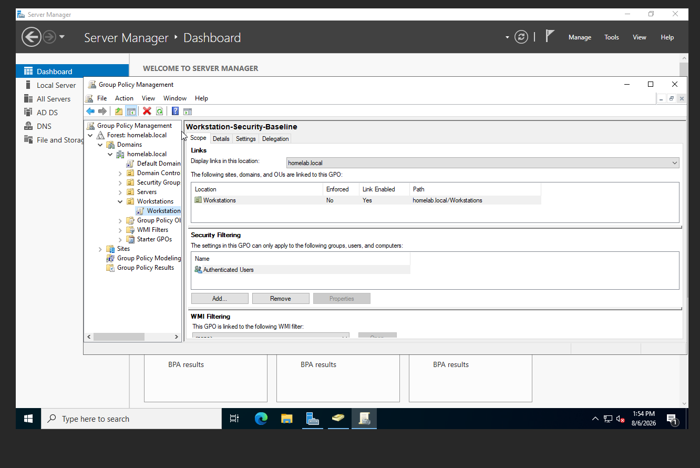
</p>

### Figure 20 – Windows Defender Firewall Group Policy

Windows Defender Firewall was centrally configured through Group Policy.

The Domain, Private, and Public profiles were configured with:

```text
Firewall State: On
Inbound Connections: Block
Outbound Connections: Allow
```

<!-- SCREENSHOT PLACEHOLDER

Use the screenshot showing all three profiles:
Domain
Private
Public

Suggested filename:
images/group-policy/windows-firewall-policy.png
-->

<p align="center">
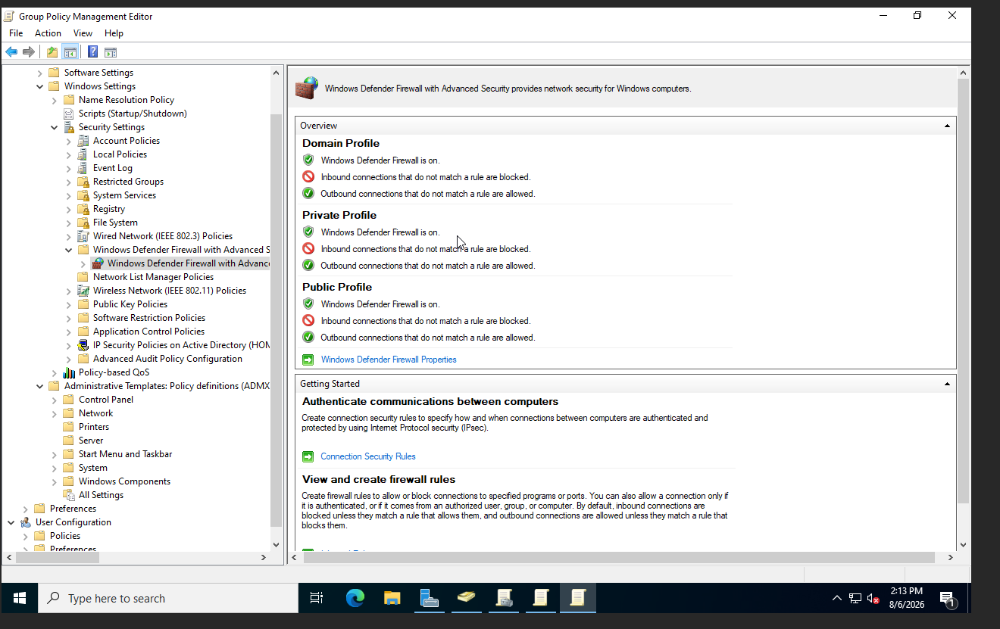
</p>

### Group Policy Validation

Policy was manually refreshed on WIN11-01:

```powershell
gpupdate /force
```

Computer policy application was verified with:

```powershell
gpresult /r /scope computer
```

WIN11-01 reported:

```text
CN=WIN11-01,OU=Workstations,DC=homelab,DC=local
```

Applied policies included:

```text
Workstation-Security-Baseline
Default Domain Policy
```

### Figure 21 – Group Policy Application Validation

The `gpresult` output confirmed that WIN11-01 successfully received the centrally managed workstation security baseline from DC01.

<!-- SCREENSHOT PLACEHOLDER

Use your screenshot showing:

COMPUTER SETTINGS
CN=WIN11-01,OU=Workstations...
Applied Group Policy Objects
Workstation-Security-Baseline
Default Domain Policy

Suggested filename:
images/group-policy/gpresult-validation.png
-->

<p align="center">
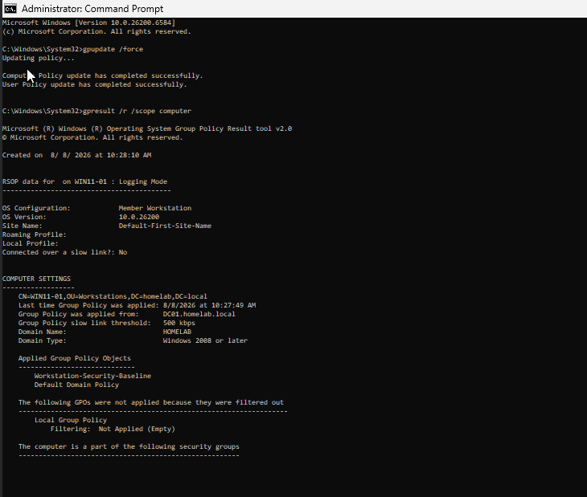
</p>

### Advanced Audit Policy Validation

Effective Windows auditing was validated directly from WIN11-01 using:

```powershell
auditpol /get /category:*
```

The configured policy enables collection of security-relevant authentication, account management, process, and policy events.

### Figure 22 – Advanced Audit Policy Validation

The effective Windows audit configuration was validated directly from the endpoint rather than relying solely on the Group Policy configuration interface.

<p align="center">
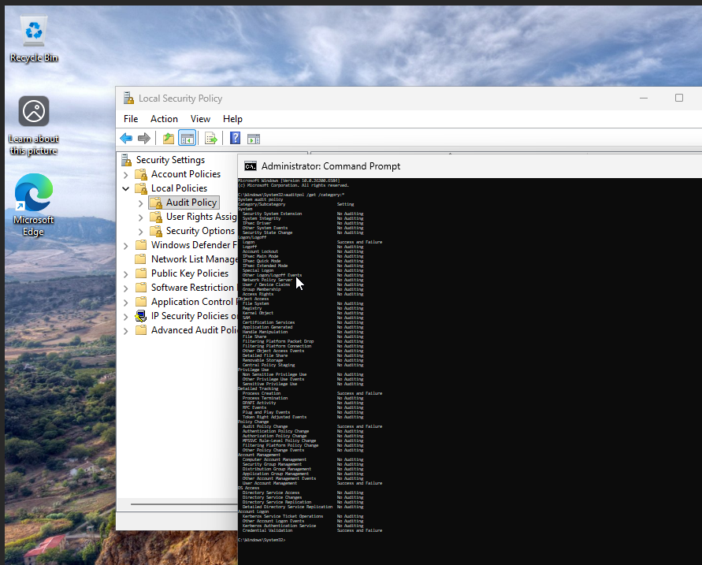
</p>

### Windows Security Event Validation

A controlled failed authentication attempt was generated to confirm that the workstation was producing security telemetry.

Windows Event Viewer recorded:

```text
Event ID: 4625
Source: Microsoft Windows Security Auditing
Task Category: Logon
Keywords: Audit Failure
Computer: WIN11-01.homelab.local
```

### Security Telemetry Flow


```mermaid
graph LR

    AD[Active Directory / GPO]
    WIN[WIN11-01]
    LOG[Windows Security Log]
    AGENT[Wazuh Agent]
    SIEM[Wazuh Manager]

    AD --> WIN
    WIN --> LOG
    LOG -.-> AGENT
    AGENT -.-> SIEM
```

The Windows endpoint is now configured to generate the security telemetry required for centralized Wazuh monitoring.

### Outcome

- Centralized workstation security baseline implemented
- GPO linked to Workstations OU
- Windows Defender Firewall centrally managed
- Password and account lockout policy settings configured
- Advanced Windows security auditing enabled
- Group Policy application validated
- Effective audit configuration verified
- Failed authentication event successfully generated
- Event ID 4625 analyzed in Windows Event Viewer
- WIN11-01 prepared for Wazuh SIEM integration

---

# Phase 9 – Wazuh Windows 11 Endpoint Integration

WIN11-01 was integrated with the existing Wazuh SIEM infrastructure to provide centralized endpoint security monitoring and Windows event analysis.

The Wazuh Agent was installed and registered with the Wazuh Manager, establishing communication between the Windows 11 workstation and the centralized monitoring infrastructure.

Validation included:

- Installed the Wazuh Agent on WIN11-01
- Registered WIN11-01 with the Wazuh Manager
- Verified the endpoint reported as an active Wazuh agent
- Confirmed Windows Security Event ingestion
- Generated controlled successful and failed authentication attempts
- Identified Windows Event ID 4625 authentication failures
- Reviewed authentication activity through the Wazuh Dashboard
- Analyzed detailed failed logon event data
- Confirmed Wazuh alert generation for failed authentication activity
- Validated centralized endpoint monitoring across the segmented network

The validated telemetry path is:

```text
WIN11-01
    |
    v
Windows Security Events
    |
    v
Wazuh Agent
    |
    v
VLAN 10 - Client
    |
    v
pfSense Inter-VLAN Routing
    |
    v
VLAN 20 - Server
    |
    v
Wazuh Manager
192.168.20.10
    |
    v
Wazuh Dashboard / Detection
```

This validation demonstrated that security events generated on a domain-joined Windows endpoint could be collected, transported across the segmented environment, analyzed by Wazuh, and presented as centralized security alerts.

### Figure 23 – Wazuh Windows 11 Endpoint Monitoring

<p align="center">
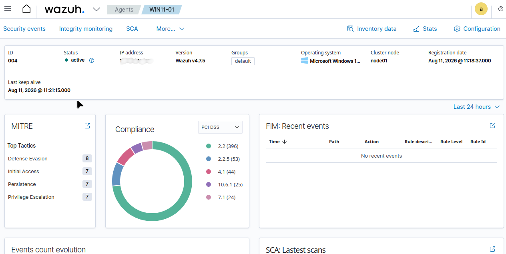
</p>

WIN11-01 reporting to the Wazuh Manager as an active endpoint, confirming successful agent registration and centralized monitoring.

### Figure 24 – Failed Authentication Detection

<p align="center">
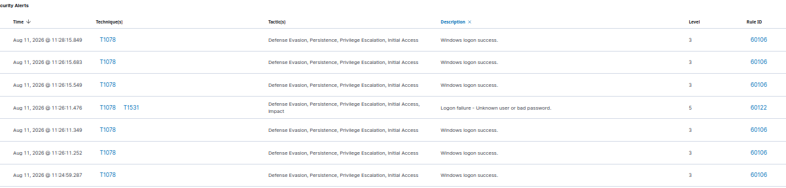
</p>

Controlled authentication testing generated Windows Event ID 4625 activity. Wazuh ingested the Windows Security event and generated a failed authentication alert, validating endpoint telemetry and SIEM detection.

---

# Phase 10 – Sysmon Endpoint Telemetry

Sysmon was deployed on WIN11-01 to extend endpoint visibility beyond standard Windows Security auditing and provide detailed system activity for centralized analysis.

Microsoft Sysinternals Sysmon was installed using a modular Sysmon configuration designed to capture security-relevant endpoint activity.

Validation included:

- Installed Sysmon on WIN11-01
- Applied and validated a Sysmon XML configuration
- Verified the Sysmon service and driver started successfully
- Confirmed Sysmon events were generated locally
- Validated telemetry through the Microsoft-Windows-Sysmon/Operational event channel
- Observed process creation and file creation activity
- Configured the Wazuh Agent to collect the Sysmon Operational event channel
- Restarted the Wazuh Agent to apply the updated configuration
- Confirmed Sysmon telemetry was forwarded to the Wazuh Manager
- Verified Wazuh applied Sysmon-specific detection rules
- Analyzed Sysmon-generated security alerts through the Wazuh Dashboard

The validated telemetry path is:

```text
WIN11-01
    |
    v
Sysmon
    |
    v
Microsoft-Windows-Sysmon/Operational
    |
    v
Wazuh Agent
    |
    v
VLAN 10 - Client
    |
    v
pfSense Inter-VLAN Routing
    |
    v
VLAN 20 - Server
    |
    v
Wazuh Manager
192.168.20.10
    |
    v
Wazuh Detection Rules / Dashboard
```

### Figure 25 – Sysmon Endpoint Telemetry

<p align="center">
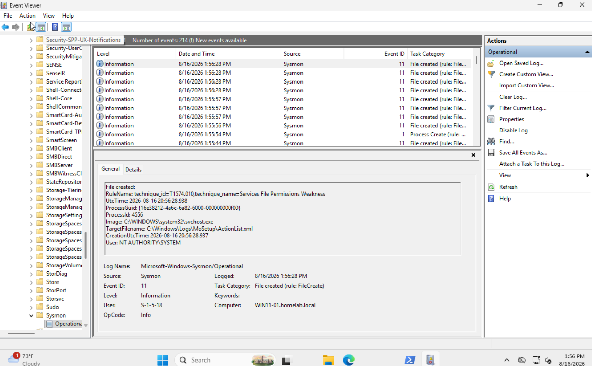
</p>

WIN11-01 generating Sysmon telemetry within the Microsoft-Windows-Sysmon/Operational event channel, confirming successful Sysmon deployment and local event generation.

### Figure 26 – Sysmon Detection in Wazuh

<p align="center">
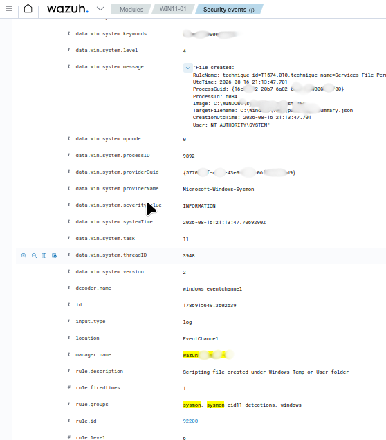
</p>

Sysmon telemetry from WIN11-01 ingested by Wazuh and matched against Sysmon-specific detection rules, validating centralized collection, endpoint visibility, and SIEM detection.

---

# Phase 11 – Splunk Enterprise Detection & Alerting

Splunk Enterprise was deployed to extend the homelab's SIEM and detection-engineering capabilities and provide a second platform for centralized Windows event analysis.

A Splunk Universal Forwarder was installed on WIN11-01 and configured to forward Windows Application, Security, and System event logs to Splunk Enterprise. 

Validation included:

- Deployed Splunk Enterprise within the Proxmox environment
- Installed the Splunk Universal Forwarder on WIN11-01
- Configured Windows Application, Security, and System log forwarding
- Verified active communication between WIN11-01 and Splunk Enterprise
- Confirmed centralized Windows event ingestion
- Generated controlled failed authentication attempts
- Identified Windows Event ID 4625 activity in Splunk
- Developed an SPL query to identify repeated failed logins
- Applied a threshold requiring multiple failed authentication attempts within a defined time window
- Converted the detection query into a scheduled Splunk alert
- Configured the alert to execute every five minutes
- Validated successful alert triggering
- Integrated SMTP-based email notifications
- Confirmed successful end-to-end delivery of the security alert by email

The validated detection workflow is:

```
    WIN11-01
        |
        v
    Windows Security Events
        |
        v
    Splunk Universal Forwarder
        |
        v
    Splunk Enterprise
        |
        v
    SPL Detection Query
        |
        v
    Repeated Failed Login Detection
        |
        v
    Scheduled Alert
        |
        v
    Email Notification
```

A detection was created for repeated failed Windows logon activity using Event ID 4625. Failed authentication attempts were grouped by account and source, and the detection was configured to alert when the defined threshold was exceeded.

This phase demonstrated the transition from simple centralized log collection into practical detection engineering and automated alerting.

### Figure 27 – Repeated Failed Login Detection

<p align="center">
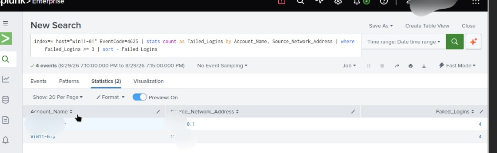
</p>

Splunk analyzed Windows Security Event ID 4625 activity from WIN11-01 and identified repeated failed authentication attempts using a custom SPL detection query.

### Figure 28 – Splunk Triggered Alert

<p align="center">
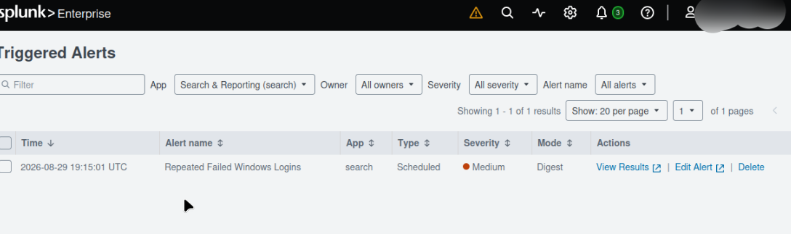
</p>

The repeated failed-login detection was converted into a scheduled Splunk alert. Controlled authentication testing successfully triggered the detection, validating the configured threshold and alert schedule.

### Figure 29 – Automated Email Alert Notification

<p align="center">
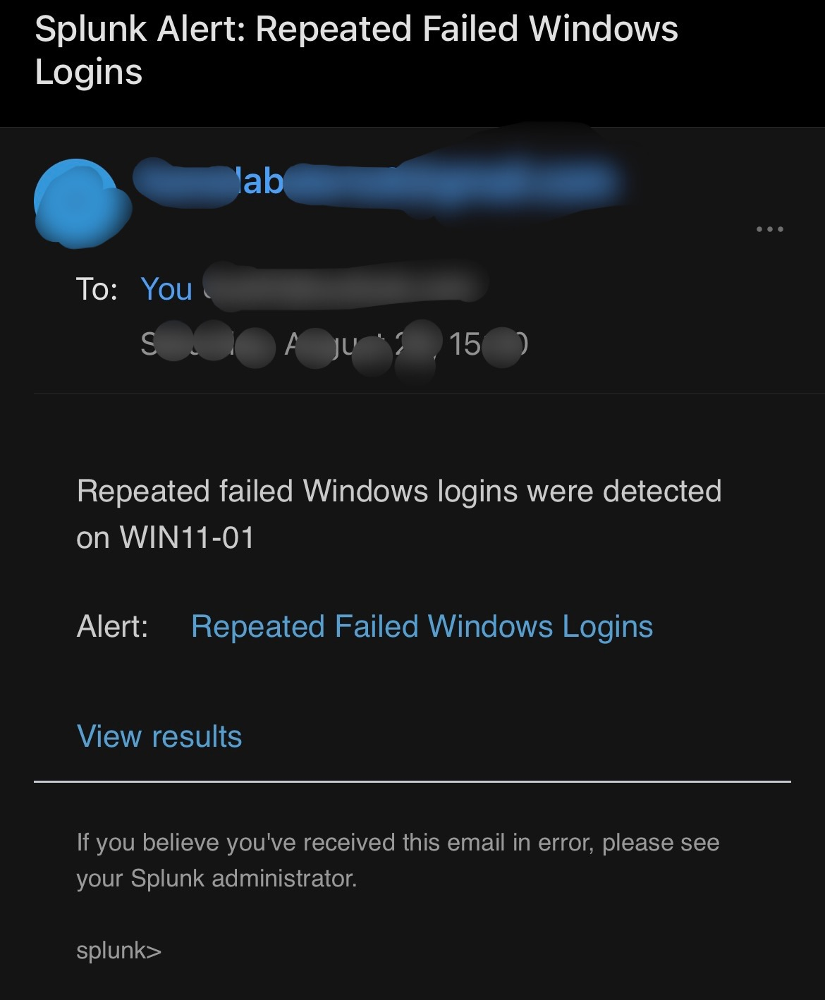
</p>

Splunk successfully generated and delivered an email notification after the repeated failed-login detection criteria were met, validating the complete workflow from Windows event generation through detection and alert notification.

### Troubleshooting Insight

During implementation, troubleshooting was required across multiple layers of the environment.

Storage pressure on the Proxmox host contributed to virtual machine instability and required expansion of available storage resources. The Splunk Universal Forwarder installation on WIN11-01 also required repair after configuration corruption was identified. After reinstalling and validating the forwarder, Windows event ingestion resumed successfully.

SMTP alerting required additional troubleshooting after the detection itself was confirmed to be functioning. Splunk alert history verified that the scheduled detection was triggering correctly, allowing the issue to be isolated to email authentication rather than the SPL query or event pipeline.

This reinforced the value of troubleshooting each layer independently: event generation, forwarding, ingestion, detection logic, alert scheduling, and notification delivery.

### Outcome

* Splunk Enterprise successfully deployed
* Windows endpoint log forwarding established
* Centralized Windows event ingestion validated
* SPL-based detection engineering implemented
* Repeated failed authentication activity detected
* Scheduled security alert successfully triggered
* Email notification workflow successfully validated
* End-to-end detection and alerting pipeline operational


---

# Firewall Policy Summary

| Source | Destination | Action | Purpose |
|---|---|---|---|
| Management | pfSense | Allow HTTPS | Firewall administration |
| Management | Proxmox | Allow TCP 8006 | Hypervisor administration |
| Management | Required Server Services | Allow | Administrative access |
| Client | Server | Restricted / Required Services | AD, DNS, security services |
| Client | Management | Restricted | Protect administrative infrastructure |
| Clients | Internet | NAT | Internet access |
| Servers | Internet | Restricted | Controlled outbound traffic |

---

# Troubleshooting & Validation Highlights

## VLAN and DHCP Troubleshooting

WIN11-01 initially received an APIPA address:

```text
169.254.x.x
```

This indicated that the workstation was not receiving a DHCP offer.

Troubleshooting included:

- Proxmox bridge validation
- VLAN tag validation
- pfSense LAN configuration
- DHCP scope validation
- Firewall inspection

The issue was traced to a VLAN tagging mismatch between WIN11-01 and the native pfSense LAN interface.

After correcting the VM network configuration and renewing DHCP:

```powershell
ipconfig /release
ipconfig /renew
```

WIN11-01 successfully received:

```text
192.168.10.101
```

## Active Directory DNS Troubleshooting

The workstation initially used pfSense for DNS:

```text
192.168.10.1
```

As a result:

```text
nslookup dc01
```

could not resolve the Active Directory host.

WIN11-01 was reconfigured to use DC01:

```text
192.168.20.20
```

Resolution was then validated using:

```text
nslookup dc01.homelab.local 192.168.20.20
```

This demonstrated the critical dependency Active Directory has on correctly configured DNS.

## Domain Controller Availability

During troubleshooting, DNS queries initially failed because DC01 was powered off.

Once DC01 was started, the workstation successfully reached:

```text
192.168.20.20
```

and Active Directory DNS services became available.

This demonstrated the dependency domain endpoints have on core infrastructure services.

## Group Policy Validation

Rather than assuming that the GPO was applied, policy deployment was explicitly validated using:

```powershell
gpupdate /force
gpresult /r /scope computer
auditpol /get /category:*
```

This confirmed both the policy source and the effective Windows audit configuration.

---

# Future Expansion

Planned enhancements include:

- Windows Event Forwarding (WEF)
- File Integrity Monitoring
- Wazuh vulnerability detection
- OpenVAS / Greenbone vulnerability scanning
- Additional Active Directory Organizational Units
- Additional Security Groups
- Service Accounts
- Active Directory security hardening
- Authentication attack simulation
- Detection engineering
- Custom Wazuh rules
- SIEM alert tuning
- IDS/IPS implementation
- Incident response exercises
- Backup and recovery strategy

---

# Key Takeaways

This project demonstrates the design, deployment, administration, security hardening, monitoring, and troubleshooting of an enterprise-style cybersecurity homelab using industry-standard infrastructure and security technologies.

Key technologies include:

- Proxmox VE
- pfSense
- Ubuntu Server
- Linux Mint
- Wazuh SIEM
- Windows Server 2022
- Windows 11 Pro
- Active Directory Domain Services
- DNS
- Group Policy
- Windows Defender Firewall
- Windows Advanced Audit Policy
- Windows Security Event Logs
- Linux Administration
- Windows Administration
- Network Segmentation
- VLANs
- Virtualization
- Firewall Administration
- Endpoint Monitoring
- Splunk Enterprise
- Splunk Universal Forwarder
- SPL

Key technical outcomes include:

- Built a VLAN-segmented virtual network from scratch
- Implemented pfSense firewall-based access controls
- Deployed centralized SIEM infrastructure
- Built an Active Directory domain using Windows Server 2022
- Configured Active Directory-integrated DNS
- Deployed and domain-joined a Windows 11 workstation
- Implemented Organizational Units, users, and security groups
- Centrally managed workstation security through Group Policy
- Configured Windows Defender Firewall through domain policy
- Implemented Advanced Windows security auditing
- Generated and analyzed Windows authentication failure events
- Troubleshot VLAN, DHCP, DNS, firewall, domain, and Group Policy issues
- Validated security controls rather than assuming successful deployment
- Integrated the Windows 11 endpoint with Wazuh SIEM
- Validated centralized Windows Security Event ingestion
- Generated controlled authentication activity for SIEM validation
- Detected and analyzed Windows Event ID 4625 failed authentication events
- Correlated Windows authentication activity with Wazuh security alerts
- Deployed Sysmon on the Windows 11 endpoint
- Applied a security-focused Sysmon configuration
- Validated local Sysmon event generation
- Integrated Sysmon telemetry with the Wazuh Agent
- Forwarded Sysmon events across the segmented network to the Wazuh Manager
- Detected and analyzed Sysmon activity using Wazuh detection rules
- Expanded endpoint visibility beyond standard Windows Security auditing
- Deployed Splunk Enterprise for centralized Windows event analysis
- Configured Splunk Universal Forwarder on WIN11-01
- Validated Windows Application, Security, and System log ingestion
- Developed an SPL detection for repeated failed Windows logons
- Converted detection logic into a scheduled security alert
- Validated automated email notification delivery
- Troubleshot the detection pipeline from endpoint telemetry through alert notification

The environment will continue to expand with vulnerability management, additional detection engineering, controlled attack simulation, SIEM analysis, alert tuning, and blue-team security operations to further simulate a production enterprise environment.