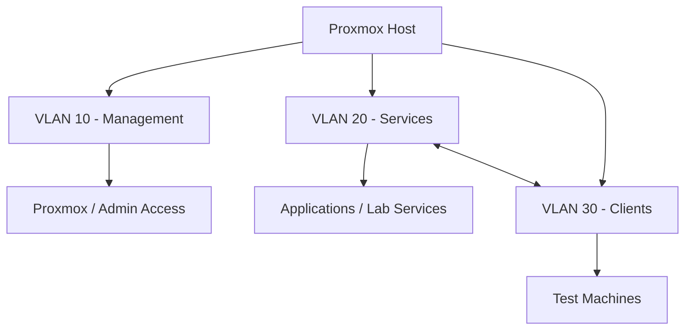

# Blue-Team-Home-Lab

## Overview 
This project documents the design and implementation of a virtualized home lab on Proxmox VE. The environment focuses on network segmentation using VLANs, virtual machine deployment, and controlled communication between isolated network segments. The lab is designed to simulate real-world infrastructure used in cybersecurity and IT environments, serving as a foundation for security tools such as SIEM, vulnerability scanning, and identity management systems.

## Skills Demonstrated
- Proxmox virtualization (KVM)
- VLAN configuration & network segmentation
- Linux networking & interface configuration
- Inter-VLAN communication & routing concepts
- Infrastructure design & troubleshooting
- System validation & connectivity testing

## Lab Environment
- Hypervisor: Proxmox VE
- Virtualization: KVM virtual machines
- Networking: VLAN-aware Linux Bridge
- Guest OS: Ubuntu/Debian-based systems

## Architecture

